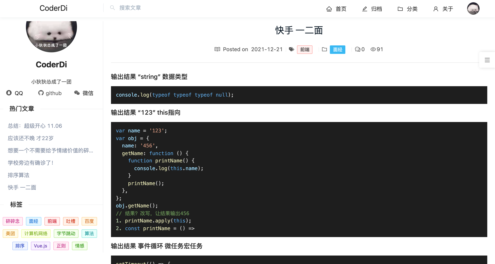
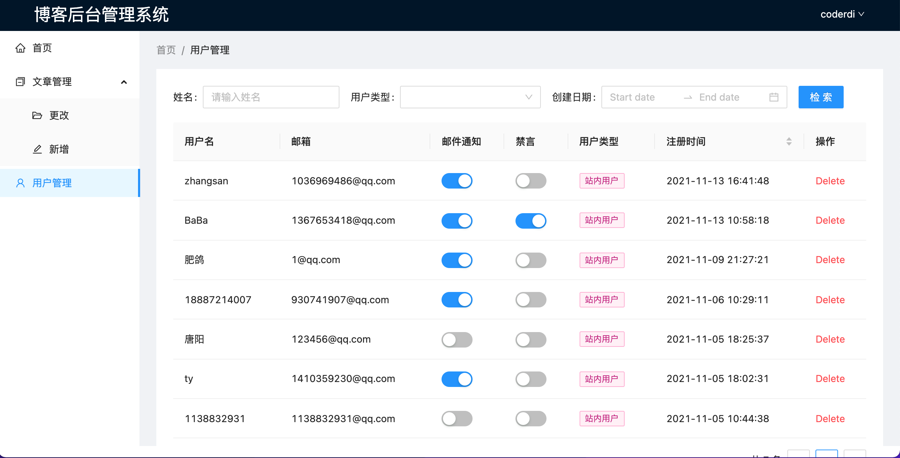
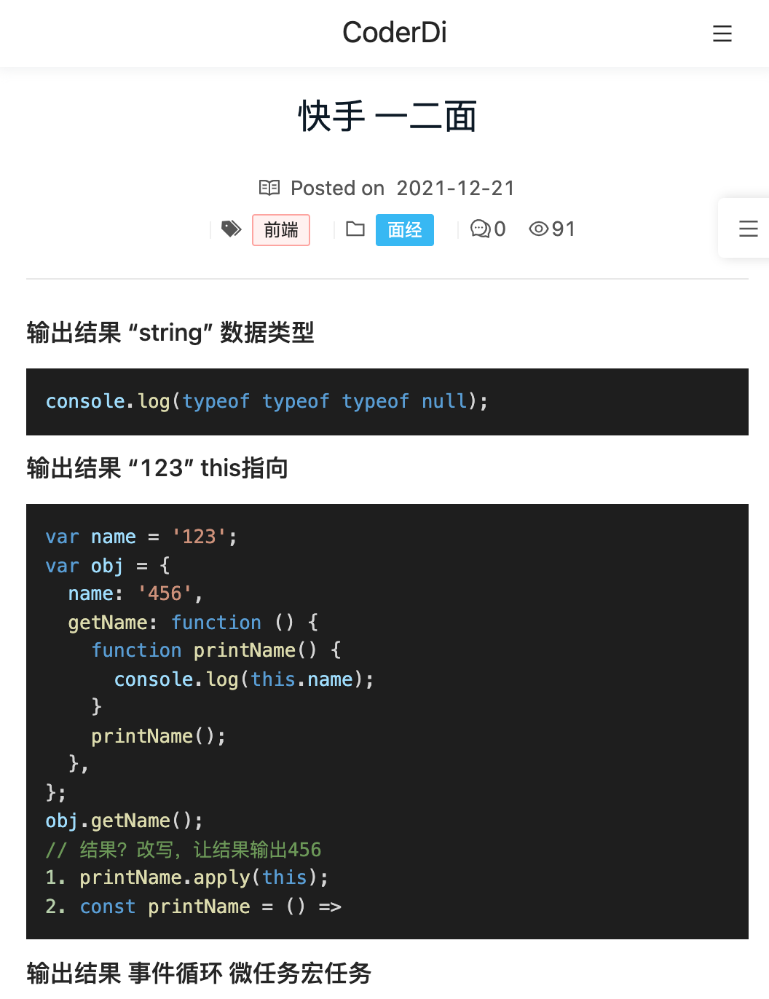
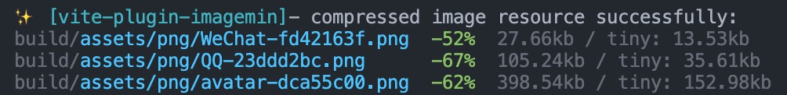

# 开始使用

- 该博客基于 Vite2 + React [Vite 官方中文文档](https://cn.vitejs.dev/).
- 构建过程可以通过 build.rollupOptions 直接调整底层的 [Rollup 选项](https://rollupjs.org/guide/zh/)

## 执行脚本

在项目目录中，您可以运行:

### 初始化项目 `yarn`

- 安装项目运行所需依赖

### 启动React项目 `yarn start`

- 在开发模式下运行应用程序
- 在浏览器中打开 [http://localhost:3000](http://localhost:3000)

### 构建生产版本 `yarn build`

- 当需要将应用部署到生产环境时，只需运行 vite build 命令。
- 默认情况下，它使用 <root>/index.html 作为其构建入口点，并生成能够静态部署的应用程序包。
- 请查阅 [部署静态站点](https://cn.vitejs.dev/guide/static-deploy.html) 获取常见服务的部署指引。

## 项目使用说明

- 源码: [https://github.com/dike1999/blog](https://github.com/dike1999/blog)
- 博客前台(访客): [http://101.201.140.172/](http://101.201.140.172/) React+Antd vite2+rollup.js自定义打包构建
- 管理后台: [http://101.201.140.172/admin](http://101.201.140.172/admin) 需权限认证
- 服务端: [http://101.201.140.172:6060/](http://101.201.140.172:6060/) Nginx反向代理+Pm2-Node
- 静态资源服务器:[http://101.201.140.172:7878/](http://101.201.140.172:7878/) 结合&图片上传云服务器-以前的项目

- PC 端界面
  

- 管理后台界面
  

- 移动端界面
  

### 性能优化

- SEO (博客暂时不能域名备案)
- gzip压缩，强缓存，协商缓存
- 自定义配置打包优化 4.3MB→2.4MB，
- 代码分割，按需加载，CI/CD自动构建
- 设备适配 响应式布局 前端代码埋点
- 前端性能优化方案 遵循雅虎军规35条

### 体积优化

#### ⚡构建时压缩图片

- 每次使用在线服务手动压缩较为麻烦，可以直接在构建流程中加入压缩图片
- vite-plugin-imagemin 一个压缩图片资产的 vite 插件

``` javascript
import viteImagemin from 'vite-plugin-imagemin';

export default () => {
  return {
    plugins: [
      viteImagemin({
        gifsicle: {
          optimizationLevel: 7,
          interlaced: false,
        },
        optipng: {
          optimizationLevel: 7,
        },
        mozjpeg: {
          quality: 20,
        },
        pngquant: {
          quality: [0.8, 0.9],
          speed: 4,
        },
        svgo: {
          plugins: [
            {
              name: 'removeViewBox',
            },
            {
              name: 'removeEmptyAttrs',
              active: false,
            },
          ],
        },
      }),
    ],
  };
};
```

- 图片压缩效果展示


### 传输优化

#### ⚡Gzip压缩传输

- Gzip压缩是一种强力压缩手段，针对文本文件时通常能减少2/3的体积。
- HTTP协议中用头部字段 **Accept-Encoding** 和 **Content-Encoding** 对「采用何种编码格式传输正文」进行了协定，请求头的 **Accept-Encoding** 会列出客户端支持的编码格式。当响应头的  **Content-Encoding** 指定了gzip时，浏览器则会进行对应解压
- 一般浏览器都支持gzip，所以 **Accept-Encoding** 也会自动带上 **gzip** ，所以我们需要让资源服务器在 **Content-Encoding** 指定 gzip，并返回gzip文件
- Nginx配置Gzip

``` shell
#开启和关闭gzip模式
gzip on;
#gizp压缩起点，文件大于1k才进行压缩
gzip_min_length 1k;
# gzip 压缩级别，1-9，数字越大压缩的越好，也越占用CPU时间
gzip_comp_level 6;
# 进行压缩的文件类型。
gzip_types text/plain application/javascript application/x-javascript text/css application/xml text/javascript ;
# nginx对于静态文件的处理模块，开启后会寻找以.gz结尾的文件，直接返回，不会占用cpu进行压缩，如果找不到则不进行压缩
gzip_static on
# 是否在http header中添加Vary: Accept-Encoding，建议开启
gzip_vary on;
# 设置gzip压缩针对的HTTP协议版本
gzip_http_version 1.1;
```

### TODO

- 定制暗黑主题+开屏动画
- 点赞功能(根据IP、访客点赞)
- 服务器端渲染SSR

### 关于prettier

- 因为prettier的一些设置规则可能和eslint冲突
- 所以去掉了在提交阶段使用prettier格式化代码
- 都使用eslint来自动格式化代码

### 规范git commit message

- 安装`commitlint`

```shell
yarn add @commitlint/cli @commitlint/config-conventional --dev
```

- 在`package.json`文件中添加commitlint配置

```json
"commitlint": {
  "extends": [
    "@commitlint/config-conventional"
  ]
}
```

- 添加Git Hooks。Git Commit 消息规则请参考: [CommitLint](https://github.com/conventional-changelog/commitlint/tree/master/@commitlint/config-conventional)

```shell
npx husky add configs/husky/commit-msg "npx --no-install commitlint --edit $1"
```

- 提交一个commit示例

```shell
git commit -m "fix: 处理了某个BUG"
```
